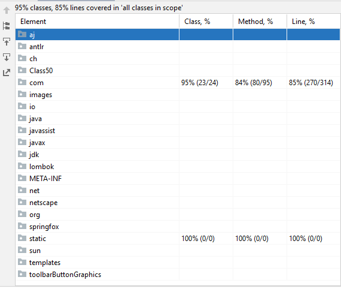

# Bol.com Mancala Assignment

### Brief Overview
What is the attitude and idea
[Solution](solution.md)

### Assumptions
What is the assumptions
[Assumptions](assumptions.md)

### How To Run
To run the application please click:
[How to run](how_to_run.md)

### How To Test
To test the application please click:
[How to test](how_to_test.md)

### How To Scale
For scaling the application please click:
[How to scale](scale.md)

### To do
To Know future works please click:
[To do](to_do.md)

## Code Coverage
A measurement of how many lines and classes of code have been tested.

